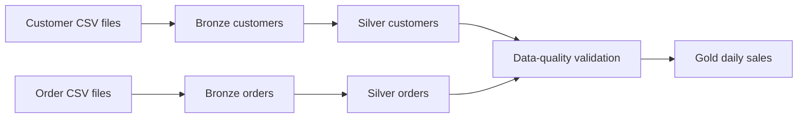
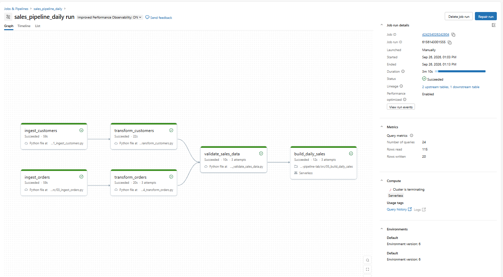

# Databricks Sales Pipeline Lab

A multi-source Bronze, Silver, and Gold data pipeline built in Databricks Serverless using Unity Catalog, PySpark, Delta Lake, SQL, Git, and Databricks Workflows.

This project demonstrates a realistic workflow dependency pattern: customer and order data are ingested and transformed independently, validated together, and then joined into a daily sales reporting table.

## Architecture



## Databricks components

- **Catalog:** `workspace`
- **Schema:** `sales_lab`
- **Landing Volume:** `workspace.sales_lab.landing_sales`
- **Compute:** Databricks Serverless
- **Workflow:** `sales_pipeline_daily`

Landing folders:

```text
/Volumes/workspace/sales_lab/landing_sales/customers
/Volumes/workspace/sales_lab/landing_sales/orders
```

## Data layers

### Bronze

Bronze preserves the original CSV data and adds ingestion metadata.

| Table | Purpose |
|---|---|
| `workspace.sales_lab.bronze_customers_raw` | Raw customer CSV records |
| `workspace.sales_lab.bronze_orders_raw` | Raw order CSV records |

Both Bronze ingestion tasks:

- read CSV files recursively from Unity Catalog Volumes;
- validate required source columns;
- add `_ingested_at` and `_source_file`;
- use a left-anti join on `_source_file` to skip files already ingested;
- append only new files to Delta tables.

### Silver

Silver cleans, types, deduplicates, and upserts the business-ready records.

| Table | Purpose |
|---|---|
| `workspace.sales_lab.silver_customers` | Clean customer dimension-style data |
| `workspace.sales_lab.silver_orders` | Clean order-level transactional data |

Transformations include:

- normalising IDs and text values;
- parsing dates and timestamps safely;
- casting quantity and monetary fields to appropriate types;
- calculating `order_date` and `order_amount`;
- retaining the latest ingested record for each business key;
- Delta `MERGE` operations for idempotent updates and inserts.

### Gold

| Table | Purpose |
|---|---|
| `workspace.sales_lab.gold_daily_sales` | Daily sales metrics by customer segment and country |

The Gold task is implemented in SQL and joins `silver_orders` with `silver_customers`.

Metrics include:

- completed orders;
- purchasing customers;
- units sold;
- gross sales;
- average order value.

Cancelled orders are excluded from the Gold reporting table.

## Workflow DAG

The Databricks Workflow has five tasks:

```text
ingest_customers → transform_customers ─┐
                                        ├→ validate_sales_data → build_daily_sales
ingest_orders    → transform_orders ────┘
```

The two ingestion/transformation branches can run in parallel. Validation runs only after both Silver tables are ready. The SQL Gold task runs only when validation succeeds.

## Data-quality validation

The validation task fails the workflow if it finds:

- duplicate `order_id` values;
- missing order or customer identifiers;
- non-positive quantities, prices, or order amounts;
- orders whose `customer_id` does not exist in `silver_customers`.

## Project structure

```text
src/
├── 01_ingest_customers.py
├── 02_transform_customers.py
├── 03_ingest_orders.py
├── 04_transform_orders.py
├── 05_build_daily_sales.sql
└── 06_validate_sales_data.py

docs/
└── screenshots/
    └── sales_pipeline_dag_success.png
```

## Running the pipeline

1. Upload customer CSV files to the `customers` landing folder.
2. Upload order CSV files to the `orders` landing folder.
3. Run the `sales_pipeline_daily` Databricks Workflow.
4. Review the five Delta tables in Catalog Explorer.
5. Query the Gold table:

```sql
SELECT *
FROM workspace.sales_lab.gold_daily_sales
ORDER BY order_date, segment, country;
```

## Evidence

The workflow completed successfully on Databricks Serverless with both source branches, validation, and the SQL Gold task:



## What this project demonstrates

- Unity Catalog schemas, Volumes, and managed Delta tables;
- medallion architecture across two independent source feeds;
- PySpark ingestion and transformation;
- SQL-based Gold reporting;
- file-once Bronze ingestion;
- Delta `MERGE` upsert patterns;
- data-quality gates;
- a multi-task Databricks Workflow DAG;
- Git-backed Databricks development and repair runs.

## Notes

This is a learning and portfolio project using sample sales data. It contains no production data, credentials, or proprietary code.
